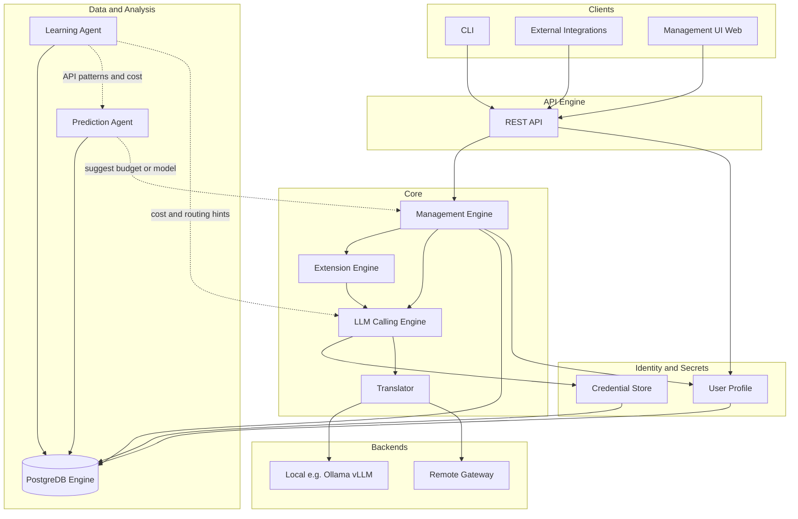

# AgentOne — Architecture Document

This document defines the runtime architecture for AgentOne, aligning with [REQUIREMENTS.md](../REQUIREMENTS.md) (agent runtime, budgets, telemetry, two backends, stable API, minimal UI) and incorporating the API Engine, Management UI, Management Engine, User Profile, PostgreDB Engine, Prediction Agent, Extension Engine, LLM Calling Engine, Translator, Learning Agent, and Credential Store.

---

## 1. High-Level Architecture Diagram

The following diagram shows how clients, the API, core components, backends, data, and identity/secrets connect. Refer to **Figure 1** for the visual overview.

**Figure 1 — High-level architecture**

*Figure 1: AgentOne architecture (PNG). Source: [architecture.mmd](architecture.mmd).*

**Diagram reading notes:**

- **Clients:** CLI, external integrations, and optional Management UI (web) all go through the **API Engine**.
- **API Engine** delegates run submission and queries to **Management Engine** and resolves **User Profile** for auth and defaults.
- **Management Engine** runs the agent loop, enforces budgets, and uses **Extension Engine** to resolve which model and tools to use; all LLM calls go through **LLM Calling Engine**.
- **LLM Calling Engine** receives a canonical request, fetches user-specific credentials from **Credential Store**, uses **Translator** to convert to the target provider’s request format, calls the backend (local or remote), and normalizes the response.
- **Translator** adapts internal format to/from each provider (OpenAI, Anthropic, Ollama, vLLM, etc.); **Credential Store** holds per-user, per-service credentials (API keys, URLs).
- **Learning Agent** ingests run telemetry and API patterns from **PostgreDB**, learns cost and API flavors, and feeds **Prediction Agent** and optionally **LLM Calling Engine** (routing/cost hints). **Prediction Agent** suggests budget or model to Management Engine (dashed edges = optional integration).

---

## 2. Component Definitions and Responsibilities

| Component | Role | Maps to requirements |
|-----------|------|----------------------|
| **API Engine** | Single stable entrypoint for external integrations. Accepts task submissions, returns run IDs; exposes run status, results, and telemetry. Versioned REST (or gRPC) so other projects use AgentOne as an "agent execution substrate." | FR-11, stable API |
| **Management Engine** | Core orchestration: runs the agent loop (plan → execute tools → observe → replan), enforces budgets (tokens, $, tool calls, retries, wall-clock), applies model routing (remote vs local fallback), termination policies, retries, and caching. Talks to model backends via Extension Engine and LLM Calling Engine. | Agent loop, budgets, FR-1–FR-10 |
| **Management UI** | Minimal UI for operators/users: submit tasks, view runs, inspect telemetry (cost breakdown, token counts, tool calls, retries, latency). Can be CLI-first with optional web dashboard for reports. | FR-12, minimal UI |
| **User Profile** | Identity and preferences per user/tenant: default budgets, preferred termination policy, model preferences, quality level. Enables per-user cost caps and reporting. *Extends* the spec (multi-user not in original). | — |
| **PostgreDB Engine** | Persistence layer: runs, run state, provenance (model IDs, prompts, tool I/O), telemetry (cost, tokens, latency), cache metadata, user profiles, and optionally replay seeds. Enables reporting, replay, and audit. | Run-level provenance, telemetry, deterministic-ish replay |
| **Prediction Agent** | Optional layer that predicts cost/latency before or during a run (e.g., by task type and history), suggests budgets or model choice, and can feed "adaptive budgeting" (allocate budget across steps). Consumes historical data from PostgreDB. | Stretch: adaptive budgeting, cost awareness |
| **Extension Engine** | Pluggable registry for: (1) Model backends (local runner e.g. Ollama/vLLM, remote gateway), (2) Tools (repos, APIs, documents), (3) Termination policies, (4) optionally custom routers. Management Engine uses it to resolve backends and tools. | NFR extensibility, two backends |
| **LLM Calling Engine** | Single component that invokes different flavors of LLMs. Receives a canonical request (model id, messages, options), resolves which provider/backend to use, and delegates to the appropriate adapter. Handles retries, timeouts, and returns a normalized response (tokens, content, latency). All external LLM calls go through this engine. | Two backends, model routing |
| **Translator** | Transforms our internal canonical API format (messages, tool schema, sampling params) into each external LLM provider’s request format (OpenAI, Anthropic, Ollama, vLLM, etc.) and vice versa for responses. One adapter per provider; LLM Calling Engine uses Translator so the rest of the system stays provider-agnostic. | Stable internal API, multi-backend |
| **Credential Store** | Keeps track of credentials per user and per service: API keys, base URLs, tokens for each LLM provider (and optionally other services). Accessed by LLM Calling Engine (and Translator when auth is provider-specific). Enables per-user model access and secure storage; can be backed by PostgreDB or a secrets manager. | Per-user backends, security |
| **Learning Agent** | Intakes different flavors of LLM API patterns and cost data (from runs, telemetry, provider docs). Learns or records: request/response shapes per provider, pricing per model, latency patterns, failure modes. Feeds Prediction Agent and/or model routing; can update cost tables and suggest which provider/model to use for a given task. Consumes PostgreDB telemetry and optionally external pricing feeds. | Cost awareness, model routing, stretch |

---

## 3. Data Flow (Simplified)

1. **Submit task:** Client → API Engine → Management Engine loads User Profile (budgets, policy) → creates Run in PostgreDB → starts loop.

2. **Agent loop — LLM call path:** Management Engine decides "call model X" → LLM Calling Engine gets (user, model_id, canonical request) → Credential Store returns credentials for that user and provider → Translator converts request to provider format → call Local or Remote backend → response translated back to canonical form → Management Engine receives tokens/content/latency → writes step + telemetry to PostgreDB → check budgets → replan or terminate per policy. Tools still via Extension Engine.

3. **Termination:** On budget breach or done, apply termination policy → persist final state and full telemetry to PostgreDB → return run result via API.

4. **Reporting:** Management UI / CLI query API Engine → read from PostgreDB (or materialized views) for cost breakdown, token counts, retry paths, latency.

5. **Prediction (optional):** Prediction Agent reads run history from PostgreDB (and optionally Learning Agent output) → suggests default budgets or model for task type → used by Management Engine or shown in UI.

6. **Learning Agent (optional):** Ingests run telemetry and provider API patterns from PostgreDB (and optionally external pricing docs) → updates cost/pattern knowledge → feeds Prediction Agent and/or LLM Calling Engine for better routing and cost estimates.

---

## 4. Placement of Requirements

- **Agent loop, budgets, termination policies, model routing:** Implemented inside **Management Engine**, with policies and limits from **User Profile** and **PostgreDB**; model *invocation* goes through **LLM Calling Engine**.

- **Two backends (local + remote):** **Extension Engine** registers backends; **LLM Calling Engine** invokes them via **Translator** (one adapter per provider). **Credential Store** supplies per-user credentials for each service.

- **Internal vs external API:** Our API is canonical; **Translator** transforms to/from each LLM provider’s request/response format so the rest of the system stays provider-agnostic.

- **Telemetry and reporting:** **PostgreDB Engine** stores; **API Engine** exposes; **Management UI** displays (CLI + optional dashboard). **Learning Agent** consumes telemetry to learn API patterns and cost.

- **Provenance and replay:** Stored in **PostgreDB**; replay can be a Management Engine mode that reads logged prompts/tool I/O and re-runs with seed.

- **Caching:** Can live in Management Engine or LLM Calling Engine (in-memory/Redis) with cache metadata in **PostgreDB**; or a dedicated cache service.

---

## 5. Design Choices and Clarifications

- **User Profile:** Adds multi-user and per-user budgets; requires auth and profile storage (PostgreDB). If you prefer single-tenant or no users, this can be reduced to "default run config" only.

- **Credential Store:** Store credentials per (user, service). Can be PostgreDB with encryption-at-rest or a dedicated secrets manager (e.g. HashiCorp Vault). LLM Calling Engine (and Translator when auth is in headers) is the only consumer.

- **Translator:** One adapter per provider (OpenAI, Anthropic, Ollama, vLLM, etc.). Input: canonical (messages, tools, sampling); output: provider request. Response path: provider response → canonical (content, token counts, latency). Keeps provider-specific quirks (tool format, streaming) in one place.

- **LLM Calling Engine:** Owns retries, timeouts, and normalized responses. Uses Extension Engine only to *resolve* which backend (e.g. "ollama/llama3" vs "openai/gpt-4"); actual HTTP/calls go through Translator + backends.

- **Learning Agent:** Can be batch (nightly) or on-demand. Inputs: run logs, token/cost telemetry, optional provider pricing pages. Outputs: cost table updates, routing hints, or features for Prediction Agent. First phase can be "record and expose" only; full learning later.

- **Management UI:** Requirements say "CLI is fine." You can ship CLI only and add a minimal web dashboard later for run list + telemetry charts.

- **Prediction Agent:** Stretch; can be a separate microservice or a library called by Management Engine at run start. First phase can skip it and use fixed budgets.

- **Extension Engine:** Can be a registry (config or code) of backend and tool implementations; no need for dynamic loading in v1 unless you want it.

---

## 6. PostgreDB Schema (Summary)

- **Runs:** run_id, user_id, status, created_at, config (budgets, policy), final state.
- **Steps / provenance:** step_id, run_id, model_id, prompts, tool I/O, token counts, latency.
- **Telemetry:** cost breakdown by model/step, retry paths, aggregated per run.
- **user_profile:** user_id, default budgets, termination policy, model preferences, quality level.
- **Credential metadata** (if stored in DB): user_id, service_id, reference to secrets (e.g. Vault path); actual secrets in Credential Store / Vault.

---

*This architecture document is the design deliverable for AgentOne. It should be updated when components or data flow change.*
